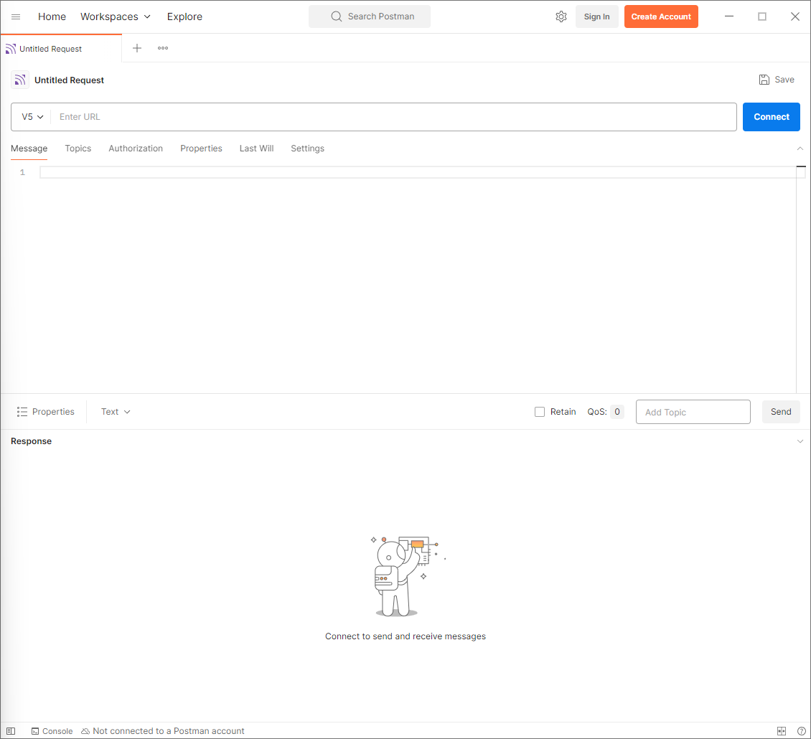
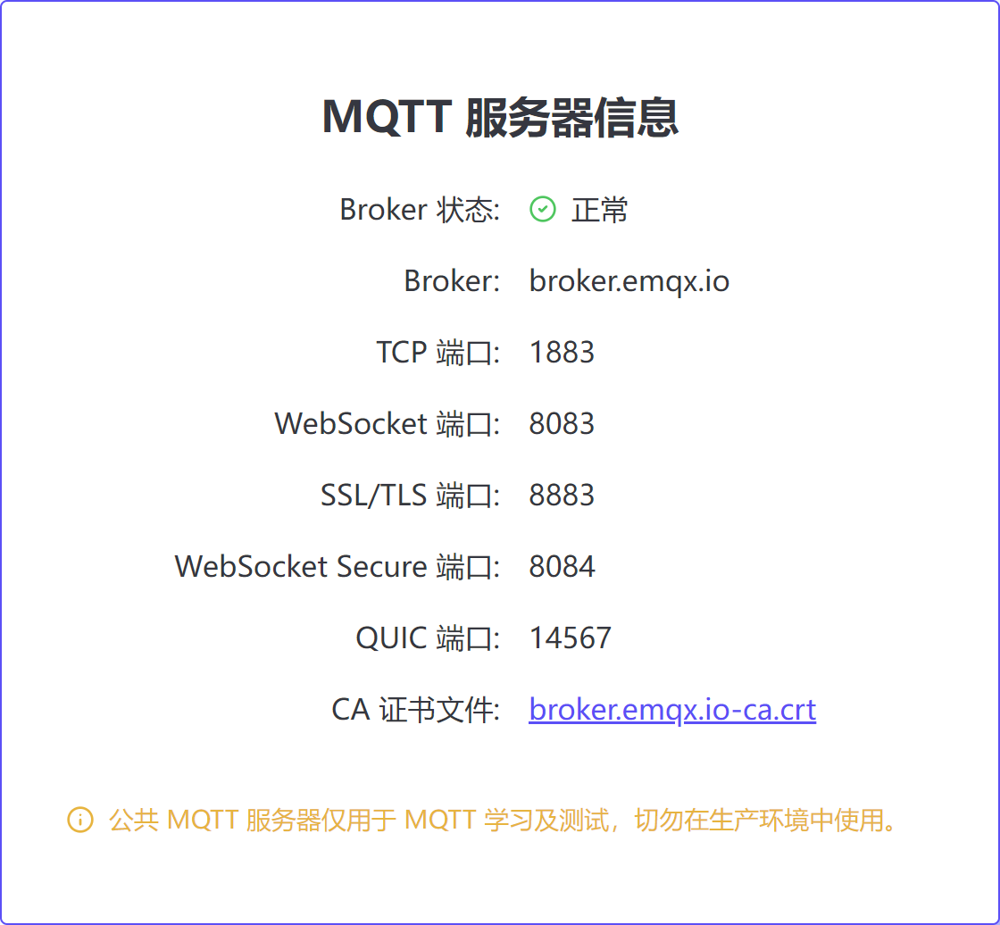
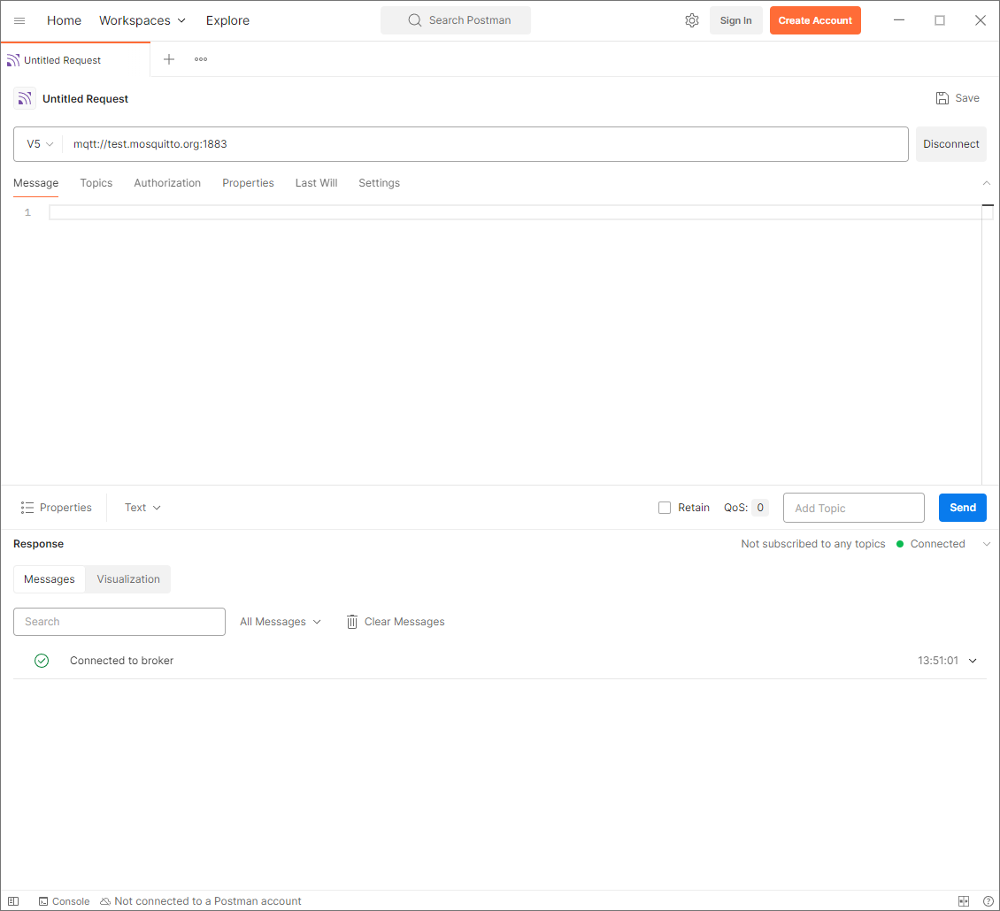
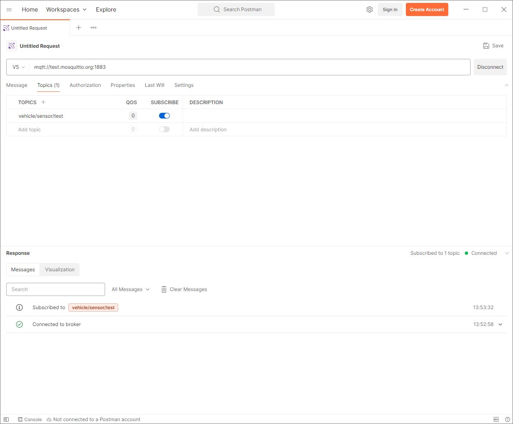
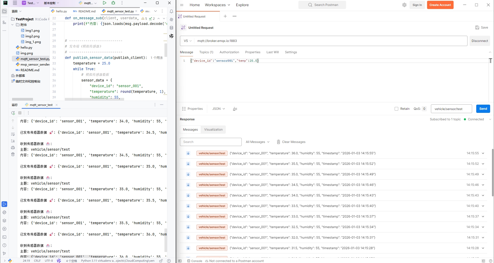

# README

- 版本管理！！！

## 核心目的：项目落地核心步骤
1. 搭建**MQTT测试环境**（Postman+Python打通通信链路）
2. 编写**20条规范测试用例**（覆盖功能/异常/性能，标注测试方法）
3. **执行用例**并**记录结果**，模拟3个核心缺陷
4. **整理项目成果**包（用例+缺陷+总结+实操截图）

## 2026/1/3

### 安装工具

* 安装 Postman
* Python 3.11
* 安装 MQTT 库：`pip install paho-mqtt`

### 一、使用 Postman 验证 MQTT 连接

- **目标**： 成功连接到公共 MQTT 服务器，并完成一次 “发布 - 订阅” 的消息交互。

- 配置服务器 → 连接 → 订阅 → 发布

1. 配置 MQTT 服务器地址在界面顶部的「Enter URL」输入框中，填入公共 MQTT 服务器的完整地址：  
`mqtt://test.mosquitto.org:1883` 国内broker:` mqtt://broker.emqx.io:1883`
（这里包含了协议mqtt://、服务器地址test.mosquitto.org、端口1883）
2. 连接到 MQTT 服务器：点击右侧的蓝色「Connect」按钮

3. 订阅主题连接成功后，切换到「Topics」标签页：  
在「Add Topic」输入框中，填写你自定义的主题（比如vehicle/sensor/test）；  
点击「SUBSCRIBE」，下方会出现该主题的监听窗口，等待接收消息。

在postman中出现发送json却断连的bug，原因不明。
换为python脚本实现mqtt“发布 + 订阅”（绕开 Postman 连接问题）。
脚本会同时扮演 “传感器（发布）” 和 “接收端（订阅）”，自己给自己发消息，验证通信。

- 已经完成了项目落地的核心环境搭建 + 端到端通信验证

### 二、编写测试用例

- **目标**：设计 20 条覆盖功能、异常和性能的测试用例，并用 Excel 规范记录。

